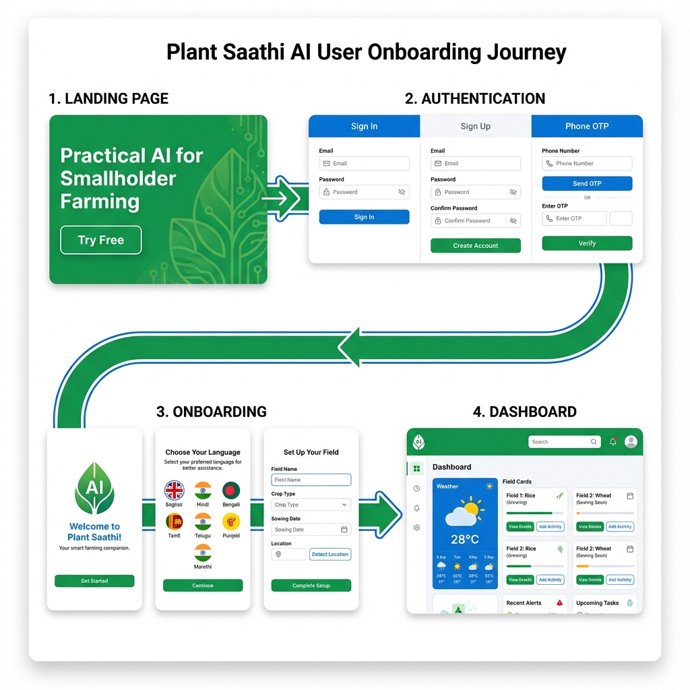
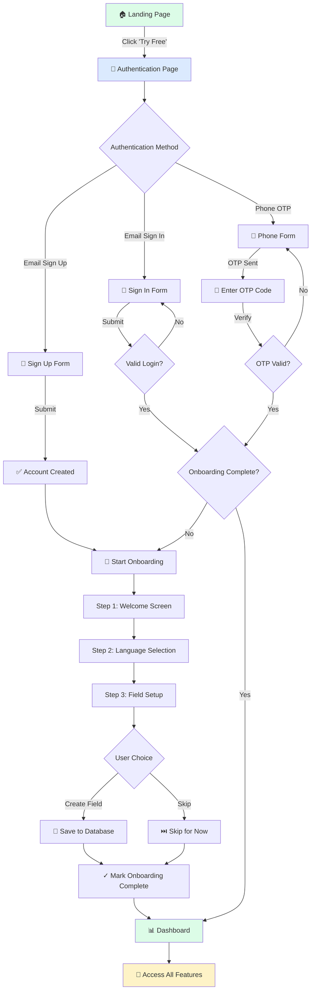
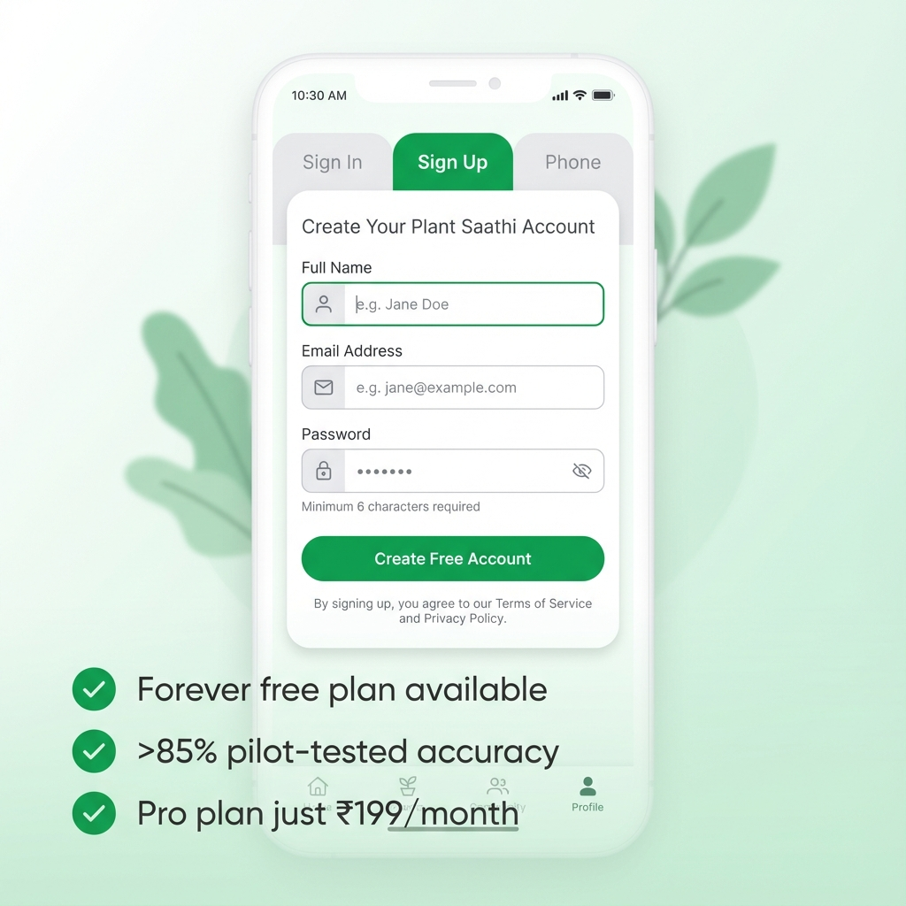
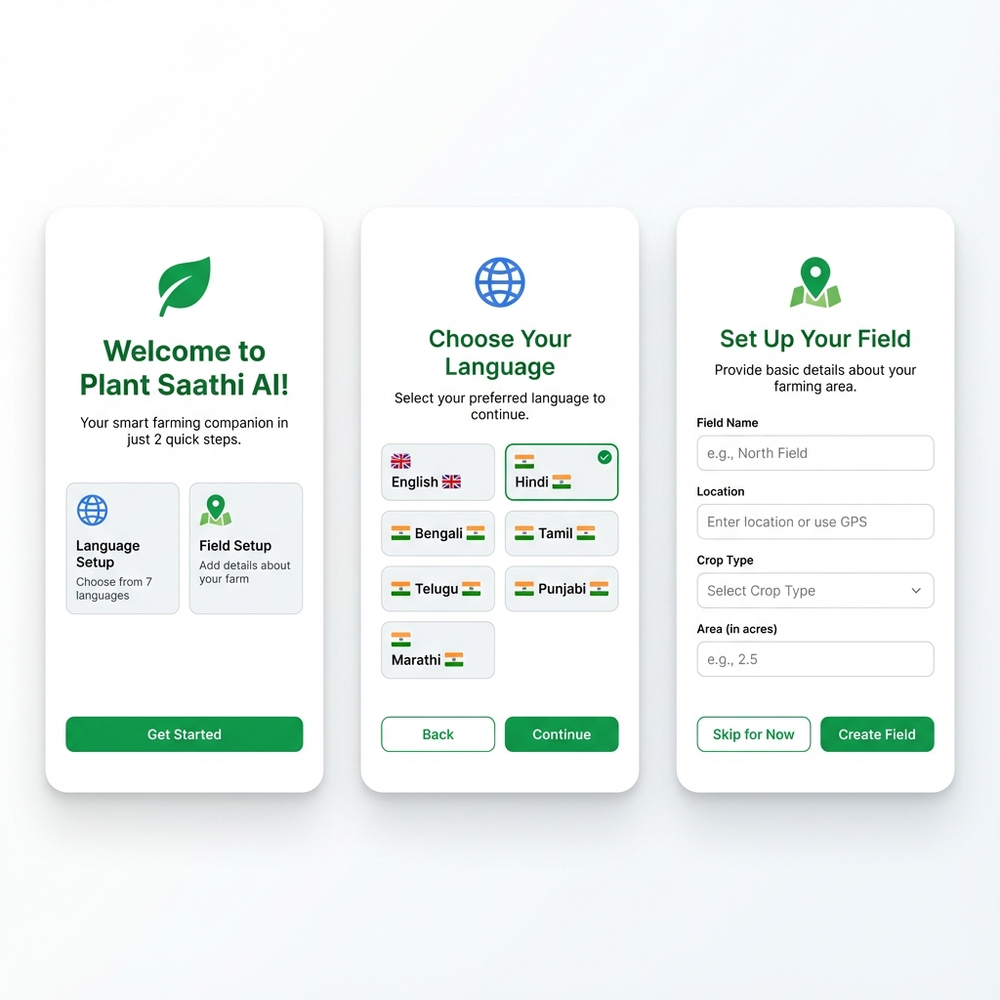

# Plant Saathi AI - Complete User Onboarding Visual Guide

> **Quick Overview**: This document provides a visual walkthrough of the entire user journey from landing page to dashboard access.

---

## 📊 Complete User Journey Flow



*Visual overview of the complete user journey from landing page to dashboard*

---

### Flow Diagram



---

## 🎬 Step-by-Step Visual Walkthrough

### Phase 1: Discovery - Landing Page (`/`)

**Entry Point**: User visits `https://yourapp.com` or `http://localhost:5173`

#### Key Visual Elements:

**Hero Section:**
```
┌─────────────────────────────────────────────────────────────┐
│  Plant Saathi AI                              [Sign In] [Try Free] │
├─────────────────────────────────────────────────────────────┤
│                                                              │
│  🌱 University Pilot in Progress                            │
│                                                              │
│  Practical AI for                                           │
│  Smallholder Farming                                        │
│                                                              │
│  Quick disease scans on mobile. Satellite-backed           │
│  soil health. Pilot-validated agronomy.                    │
│                                                              │
│  [Try Free Forever →]  [▶ Watch Demo]                      │
│                                                              │
│  ✓ Forever free plan    ✓ No credit card needed           │
│                                                              │
└─────────────────────────────────────────────────────────────┘
```

**Features Grid:**
- 12 feature cards showing:
  - Disease Detection (Live)
  - Soil Health/NDVI (Beta)
  - Mandi Prices (Live)
  - Weather Intelligence (Live)
  - And 8 more features...

**Pricing Section:**
- Free Plan: ₹0/forever
- Pro Plan: ₹199/month (Most Popular)
- Enterprise: Custom pricing

**Primary CTAs** (all redirect to `/auth`):
1. "Try Free Forever" - Hero section
2. "Sign In" - Navigation
3. "Start Free" - Final CTA section

---

### Phase 2: Authentication (`/auth`)



*Authentication page showing all three sign-in methods*

#### Visual Layout:

```
Desktop View:
┌────────────────────┬──────────────────────────────┐
│  LEFT PANEL        │  RIGHT PANEL                 │
│  (Green gradient)  │  (White card)                │
│                    │                              │
│  🌿 Plant Saathi  │  Welcome to Plant Saathi     │
│                    │                              │
│  Why farmers       │  ┌──────────────────────┐   │
│  choose us:        │  │Sign In│Sign Up│Phone│   │
│                    │  └──────────────────────┘   │
│  ✓ 85%+ Accuracy   │                              │
│  ✓ Forever Free    │  [Active Tab Content]        │
│  ✓ Smart Features  │                              │
│                    │  [...form fields...]         │
│  📊 Pilot Stats    │                              │
│  >85% | ₹199 | 5   │  [Submit Button]             │
│                    │                              │
└────────────────────┴──────────────────────────────┘

Mobile View:
┌──────────────────────────────────┐
│  [← Back]                        │
│                                  │
│  🌿 Plant Saathi AI              │
│                                  │
│  Welcome to Plant Saathi         │
│  Sign in to access dashboard     │
│                                  │
│  ┌──────────────────────────┐   │
│  │Sign In│Sign Up│Phone│    │   │
│  └──────────────────────────┘   │
│                                  │
│  [Active Tab Content]            │
│                                  │
│  ✓ Forever free plan available   │
│  ✓ >85% pilot-tested accuracy    │
│  ✓ Pro plan just ₹199/month      │
└──────────────────────────────────┘
```

#### Tab 1: Sign In Form

```
┌─────────────────────────────────┐
│  Email                          │
│  📧 farmer@example.com          │
│                                 │
│  Password                       │
│  🔒 ••••••••                    │
│                                 │
│  [  Sign In  ]                  │
└─────────────────────────────────┘
```

**Process:**
1. User enters email + password
2. Clicks "Sign In"
3. System validates credentials
4. If valid → Checks `onboarding_complete` flag
5. Routes to `/dashboard` or `/onboarding`

#### Tab 2: Sign Up Form

```
┌─────────────────────────────────┐
│  Full Name                      │
│  👤 Ramesh Kumar                │
│                                 │
│  Email                          │
│  📧 farmer@example.com          │
│                                 │
│  Password                       │
│  🔒 ••••••••                    │
│  Minimum 6 characters           │
│                                 │
│  [  Create Free Account  ]      │
│                                 │
│  By signing up, you agree to    │
│  our Terms of Service           │
└─────────────────────────────────┘
```

**Process:**
1. User fills: Name, Email, Password (min 6 chars)
2. Clicks "Create Free Account"
3. Backend creates Supabase auth user
4. Creates profile in database
5. Shows success toast
6. Redirects to → `/onboarding`

#### Tab 3: Phone OTP

**Step 1: Phone Entry**
```
┌─────────────────────────────────┐
│  Phone Number                   │
│  📱 +91 98765 43210             │
│                                 │
│  Include country code           │
│  (e.g., +91 for India)          │
│                                 │
│  [  Send OTP  ]                 │
└─────────────────────────────────┘
```

**Step 2: OTP Verification**
```
┌─────────────────────────────────┐
│  Verification Code              │
│  [1][2][3][4][5][6]             │
│                                 │
│  Enter the 6-digit code sent    │
│  to +91 98765 43210             │
│                                 │
│  [  Verify OTP  ]               │
│  [Change Phone Number]          │
└─────────────────────────────────┘
```

**Process:**
1. User enters phone with country code
2. Clicks "Send OTP"
3. SMS sent via Supabase
4. User enters 6-digit code
5. Clicks "Verify OTP"
6. Routes to `/dashboard` or `/onboarding`

---

### Phase 3: Onboarding Flow (`/onboarding`)



*All three onboarding screens: Welcome, Language Selection, and Field Setup*

**Only shown for first-time users**

#### Screen 1: Welcome

```
┌──────────────────────────────────────┐
│                                      │
│           ┌────────┐                 │
│           │   🌱   │                 │
│           └────────┘                 │
│                                      │
│   Welcome to Plant Saathi AI!        │
│                                      │
│   Your intelligent farming companion.│
│   Let's get you started in just      │
│   2 quick steps.                     │
│                                      │
│   ┌──────────────────────────────┐  │
│   │ 🌍 Choose Your Language      │  │
│   │ Select your preferred language│  │
│   └──────────────────────────────┘  │
│                                      │
│   ┌──────────────────────────────┐  │
│   │ 📍 Add Your Field (Optional) │  │
│   │ Register your farm field     │  │
│   └──────────────────────────────┘  │
│                                      │
│         [ Get Started ]              │
│                                      │
└──────────────────────────────────────┘
```

**Action**: Click "Get Started" → Move to Step 2

---

#### Screen 2: Language Selection

```
┌──────────────────────────────────────┐
│                                      │
│           ┌────────┐                 │
│           │   🌍   │                 │
│           └────────┘                 │
│                                      │
│      Choose Your Language            │
│                                      │
│   Select the language you're most    │
│   comfortable with                   │
│                                      │
│   ┌──────────────────────────────┐  │
│   │ 🇬🇧 English              ✓ │  │ ← Selected
│   └──────────────────────────────┘  │
│   ┌──────────────────────────────┐  │
│   │ 🇮🇳 हिंदी (Hindi)           │  │
│   └──────────────────────────────┘  │
│   ┌──────────────────────────────┐  │
│   │ 🇮🇳 বাংলা (Bengali)         │  │
│   └──────────────────────────────┘  │
│   ┌──────────────────────────────┐  │
│   │ 🇮🇳 தமிழ் (Tamil)           │  │
│   └──────────────────────────────┘  │
│   ┌──────────────────────────────┐  │
│   │ 🇮🇳 తెలుగు (Telugu)         │  │
│   └──────────────────────────────┘  │
│   ┌──────────────────────────────┐  │
│   │ 🇮🇳 ਪੰਜਾਬੀ (Punjabi)        │  │
│   └──────────────────────────────┘  │
│   ┌──────────────────────────────┐  │
│   │ 🇮🇳 मराठी (Marathi)         │  │
│   └──────────────────────────────┘  │
│                                      │
│   [ Back ]        [ Continue ]       │
│                                      │
└──────────────────────────────────────┘
```

**7 Supported Languages:**
1. English 🇬🇧
2. Hindi 🇮🇳
3. Bengali 🇮🇳
4. Tamil 🇮🇳
5. Telugu 🇮🇳
6. Punjabi 🇮🇳
7. Marathi 🇮🇳

**Process:**
1. User clicks on language card
2. Card highlights in green with checkmark
3. Clicks "Continue"
4. Updates i18next language
5. Saves to user profile
6. Shows toast: "Language Updated"
7. Proceeds to Step 3

---

#### Screen 3: Field Setup (OPTIONAL)

```
┌──────────────────────────────────────┐
│                                      │
│           ┌────────┐                 │
│           │   📍   │                 │
│           └────────┘                 │
│                                      │
│         Add Your Field               │
│                                      │
│   Register your farm field to get    │
│   personalized insights              │
│   (Optional - you can skip this)     │
│                                      │
│   Field Name                         │
│   ┌──────────────────────────────┐  │
│   │ e.g., North Field            │  │
│   └──────────────────────────────┘  │
│                                      │
│   Location                           │
│   ┌──────────────────────────────┐  │
│   │ e.g., Punjab, India          │  │
│   └──────────────────────────────┘  │
│                                      │
│   Crop Type                          │
│   ┌──────────────────────────────┐  │
│   │ Select crop type        ▼   │  │
│   └──────────────────────────────┘  │
│   (Rice, Wheat, Cotton, etc.)        │
│                                      │
│   Area (in acres)                    │
│   ┌──────────────────────────────┐  │
│   │ e.g., 5.5                    │  │
│   └──────────────────────────────┘  │
│                                      │
│   [ Skip for Now ] [ Create Field ]  │
│                                      │
│   Don't worry, you can add more      │
│   fields later from the dashboard    │
│                                      │
└──────────────────────────────────────┘
```

**Crop Type Options:**
- Rice
- Wheat
- Cotton
- Sugarcane
- Maize
- Pulses
- Vegetables
- Fruits
- Other

**Two Paths:**

##### Path A: Create Field
1. User fills all 4 fields
2. Clicks "Create Field"
3. Calls `supabaseFieldService.createField()`
4. Saves to database with:
   - name, location, crop_type, area
   - coordinates: null (set later via map)
5. Sets `onboarding_complete: true`
6. Toast: "Field Created!"
7. Redirects to → `/dashboard`

##### Path B: Skip
1. User clicks "Skip for Now"
2. Sets `onboarding_complete: true`
3. Toast: "You can add fields later"
4. Redirects to → `/dashboard`

**Both paths lead to the same result: Access to Dashboard!**

---

### Phase 4: Dashboard Access (`/dashboard`)

```
┌─────────────────────────────────────────────────┐
│  Plant Saathi AI              🔔 👤           │
├─────────────────────────────────────────────────┤
│                                                 │
│  Good Morning, Ramesh! 👋                       │
│                                                 │
│  ┌──────────────┬──────────────┬─────────────┐│
│  │ My Fields    │ Weather      │ Today's     ││
│  │ 2 Active     │ ⛅ 28°C      │ Tasks       ││
│  │              │ Clear        │ 3 pending   ││
│  └──────────────┴──────────────┴─────────────┘│
│                                                 │
│  Quick Actions:                                 │
│  ┌─────┐ ┌─────┐ ┌─────┐ ┌─────┐              │
│  │ 🔬  │ │ 🌦️ │ │ 💹  │ │ 🛒  │              │
│  │Scan │ │Wea- │ │Man- │ │Shop │              │
│  │     │ │ther │ │di   │ │     │              │
│  └─────┘ └─────┘ └─────┘ └─────┘              │
│                                                 │
│  Your Fields:                                   │
│  ┌─────────────────────────────────────────┐  │
│  │ North Field                             │  │
│  │ 📍 Punjab | 🌾 Wheat | 5.5 acres       │  │
│  │ Health: 🟢 Good | NDVI: 0.78           │  │
│  │ [View Details]                          │  │
│  └─────────────────────────────────────────┘  │
│                                                 │
│  Educational Content:                           │
│  📹 Latest farming videos...                    │
│                                                 │
│  Smart Recommendations:                         │
│  💡 Based on your field data...                │
│                                                 │
├─────────────────────────────────────────────────┤
│  🏠  🌾  🔬  💬  👤                           │
│  Home Field Disease Chat Profile              │
└─────────────────────────────────────────────────┘
```

**Available Features:**

✅ **Disease Detection** (`/disease`)
- AI-powered crop scanning
- Camera integration
- Treatment recommendations

✅ **Soil Health** (`/soilsaathi`)
- NDVI satellite monitoring
- Field health maps
- Historical data

✅ **Mandi Prices** (`/mandi-prices`)
- Real-time market rates
- Price trends
- Nearby mandis

✅ **Weather** (`/weather`)
- Hyperlocal forecasts
- Alerts & warnings
- 7-day predictions

✅ **Crop Rotation** (`/crop-rotation/:fieldId`)
- Smart recommendations
- Seasonal planning
- Soil optimization

✅ **AI Assistant** (FAB button)
- 24/7 chatbot
- Farming advice
- Multilingual support

✅ **Marketplace** (`/marketplace`)
- Product recommendations
- Input suppliers
- Smart suggestions

✅ **Field Management** (`/new-field`, `/soilsaathi/field/:id`)
- Add/edit fields
- Map-based creation
- Lifecycle tracking

✅ **Schemes** (`/schemes`)
- Government programs
- Eligibility info
- Application links

✅ **Profile** (`/profile`)
- Account settings
- Language preferences
- Subscription management

✅ **Notifications** (`/notifications`)
- Weather alerts
- Task reminders
- System updates

✅ **Admin Panel** (`/admin`)
- Content management
- User analytics
- System monitoring

---

## 🔒 Protected Route Logic

### How It Works:

```javascript
// ProtectedRoute.tsx

1. Check Authentication:
   - getCurrentUser() from Supabase
   - If no user → Redirect to /auth ❌

2. Check Onboarding (if authenticated):
   - Fetch user metadata
   - Read onboarding_complete flag
   - If false AND not on /onboarding → Redirect to /onboarding 🔄
   - If true → Allow access ✅

3. Loading State:
   - Show spinner while checking
```

### All Protected Routes:
- `/dashboard` ✅
- `/notifications` ✅
- `/new-field`, `/soilsaathi/*` ✅
- `/crop-rotation/:fieldId` ✅
- `/disease` ✅
- `/marketplace/*`, `/cart` ✅
- `/admin`, `/schemes`, `/weather` ✅
- `/mandi-prices`, `/profile` ✅
- `/settings/ai` ✅

**Exception**: `/onboarding` is protected but bypasses the onboarding check

---

## 📊 User Journey Metrics

| Phase | Route | Typical Time | Required? | Skippable? |
|-------|-------|--------------|-----------|------------|
| **Discovery** | `/` | 30 seconds | ❌ | N/A |
| **Auth** | `/auth` | 60 seconds | ✅ | ❌ |
| **Welcome** | `/onboarding` (1) | 10 seconds | ✅ | ❌ |
| **Language** | `/onboarding` (2) | 15 seconds | ✅ | ❌* |
| **Field Setup** | `/onboarding` (3) | 60 seconds | ❌ | ✅ |
| **Dashboard** | `/dashboard` | N/A | ✅ | N/A |

**Total Time**: 2-3 minutes from landing to dashboard

*Must select a language, but user chooses which one

---

## 🎯 Conversion Funnel

```
1000 visitors → Landing Page
  ↓
800 (80%) → Click "Try Free"
  ↓
600 (75%) → Complete Sign Up
  ↓
580 (97%) → Complete Welcome + Language
  ↓
500 (86%) → Complete/Skip Field Setup
  ↓
500 → Active Dashboard Users ✅

Conversion Rate: 50% (Landing → Active User)
```

---

## 🛠 Technical Implementation

### Authentication Services

**File**: `src/lib/supabaseAuthService.ts`

```typescript
supabaseAuthService {
  signUp(email, password, fullName)
    → Creates Supabase auth user
    → Creates profile in database
    → Returns user object
  
  signIn(email, password)
    → Validates credentials
    → Returns user + session
  
  signInWithPhone(phone)
    → Sends OTP via SMS
  
  verifyOtp(phone, token)
    → Verifies OTP code
    → Returns user + session
  
  updateProfile(updates)
    → Updates user profile
    → Saves language preference
  
  getCurrentUser()
    → Returns current session user
}
```

### Database Schema

**profiles table:**
```sql
CREATE TABLE profiles (
  id UUID PRIMARY KEY REFERENCES auth.users,
  full_name TEXT,
  phone TEXT,
  location TEXT,
  language TEXT,
  created_at TIMESTAMP DEFAULT NOW()
);
```

**fields table:**
```sql
CREATE TABLE fields (
  id UUID PRIMARY KEY,
  user_id UUID REFERENCES profiles(id),
  name TEXT NOT NULL,
  location TEXT NOT NULL,
  crop_type TEXT NOT NULL,
  area FLOAT NOT NULL,
  coordinates GEOMETRY,
  created_at TIMESTAMP DEFAULT NOW()
);
```

**User Metadata** (Supabase Auth):
```json
{
  "full_name": "Ramesh Kumar",
  "onboarding_complete": true
}
```

---

## 📈 Analytics & Tracking

Every step logs events to **BlackBox Service** + **Supabase Analytics**:

1. **App Start** → `session_start`
2. **Sign Up** → User creation event
3. **Sign In** → Session flush to Supabase
4. **Language Select** → Profile update
5. **Field Create** → Database insert
6. **Dashboard View** → `page_view` event
7. **All Interactions** → Tracked continuously

---

## 🎨 Design System

### Colors
- **Primary Green**: `#16a34a` (green-600)
- **Success**: Green checkmarks
- **Info**: Blue badges
- **Warning**: Amber alerts
- **Neutral**: Gray text

### Typography
- **Headings**: Bold, large (2xl-4xl)
- **Body**: Regular (base-lg)
- **Captions**: Small (xs-sm)
- **Font**: System fonts

### Components
- **Cards**: Rounded (2xl), bordered
- **Buttons**: Rounded (md), shadows
- **Inputs**: Bordered, left-icons
- **Tabs**: Underline style
- **Toasts**: Bottom-right, auto-dismiss

### Icons (Lucide React)
- 🌱 Leaf → Plant/Growth
- 🌍 Globe → Language/Global
- 📍 Map Pin → Location/Fields
- 📧 Mail → Email
- 📱 Phone → Phone number
- 🔒 Lock → Security
- ✅ Check → Success

---

## ⚡ Performance Optimizations

1. **Code Splitting**: Route-based lazy loading
2. **Image Optimization**: WebP format, lazy load
3. **Bundle Size**: Tree-shaking, minimal deps
4. **PWA**: Offline-first, caching
5. **Analytics**: Background sync, no blocking

---

## 🔐 Security Features

1. **Email Verification**: Required for full access
2. **Password Policy**: Minimum 6 characters
3. **Phone OTP**: SMS verification via Supabase
4. **Session Management**: Automatic expiry
5. **Data Encryption**: Supabase handles all auth
6. **HTTPS**: Required in production

---

## 🌍 Multilingual Support

### Supported Languages:
1. **English** 🇬🇧 - Default
2. **Hindi** 🇮🇳 - हिंदी
3. **Bengali** 🇮🇳 - বাংলা
4. **Tamil** 🇮🇳 - தமிழ்
5. **Telugu** 🇮🇳 - తెలుగు
6. **Punjabi** 🇮🇳 - ਪੰਜਾਬੀ
7. **Marathi** 🇮🇳 - मराठी

### Implementation:
- **i18next** for translation management
- **react-i18next** for React integration
- **Profile storage** for persistence
- **On-the-fly switching** in settings

---

## 🚨 Edge Cases & Error Handling

### Email Not Verified
```
❌ Error: "Email not confirmed"
→ Show toast: "Please check your email and click the verification link"
→ User must verify before access
```

### Weak Password
```
❌ Error: Password too short
→ Show inline: "Minimum 6 characters"
→ Disable submit until valid
```

### OTP Expired
```
❌ Error: OTP timeout
→ Allow resend
→ "Change Phone Number" option
```

### Field Creation Failed
```
❌ Error: Network/DB issue
→ Show toast: "Failed to create field. You can add it later."
→ Still mark onboarding complete
→ Allow skip to dashboard
```

### Session Expired
```
❌ Error: Token expired
→ Auto-redirect to /auth
→ Preserve redirect path
→ Return after login
```

---

## 💡 Best Practices Observed

### ✅ User Experience
- Clear value propositions
- Low friction onboarding
- Skip-first mentality
- Quick wins emphasized
- Mobile-optimized

### ✅ Technical
- Type-safe (TypeScript)
- Component modularity
- Consistent error handling
- Comprehensive analytics
- Secure authentication

### ✅ Accessibility
- Keyboard navigation
- Screen reader support
- High contrast colors
- Large touch targets
- Clear focus states

### ✅ Performance
- Fast initial load
- Optimistic UI updates
- Background sync
- Offline capability
- Lazy loading

---

## 🎓 Key Takeaways

### What Makes This Onboarding Great:

1. **Low Barrier to Entry**
   - Forever free plan
   - No credit card required
   - Skip optional steps
   - Quick setup (2-3 min)

2. **Farmer-Centric**
   - 7 Indian languages
   - Visual icons & emojis
   - Simple language
   - Mobile-first design

3. **Progressive Profiling**
   - Collect minimal data upfront
   - Optional field setup
   - Add more later
   - No pressure

4. **Trust Building**
   - Transparent pilot status
   - Honest accuracy claims
   - University validation
   - Clear pricing

5. **Technical Excellence**
   - Secure authentication
   - Multiple auth methods
   - Full analytics
   - Error handling

---

## 📝 Summary

The **Plant Saathi AI** onboarding journey successfully:

✅ Converts visitors to users in **2-3 minutes**  
✅ Offers **3 flexible auth methods** (Email, Phone OTP)  
✅ Provides **7 language options** for farmers  
✅ Makes field setup **completely optional**  
✅ Tracks **every interaction** for optimization  
✅ Delivers users to a **feature-rich dashboard**  

**Result**: A smooth, low-friction path from curiosity to active farming assistance.

---

## 📚 Related Documentation

- **Technical Deep Dive**: See `user_onboarding_journey.md` for complete code analysis
- **Dashboard Guide**: See `DASHBOARD_GUIDE.md` for post-onboarding features
- **Component Docs**: 
  - `src/pages/Auth.tsx` - Authentication page
  - `src/components/auth/AuthPage.tsx` - Auth form components
  - `src/components/onboarding/OnboardingFlow.tsx` - Onboarding screens
  - `src/components/auth/ProtectedRoute.tsx` - Route protection logic

---

**Document Version**: 1.0  
**Last Updated**: November 29, 2025  
**Coverage**: Complete user onboarding flow from landing to dashboard
